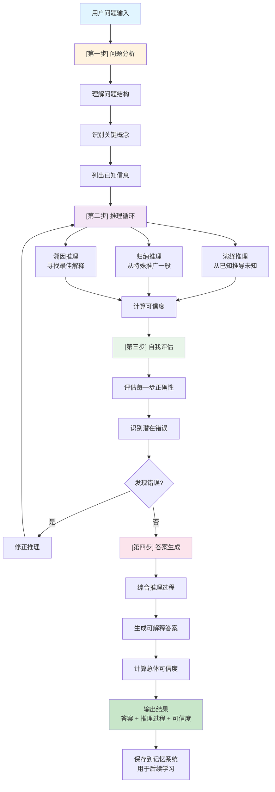
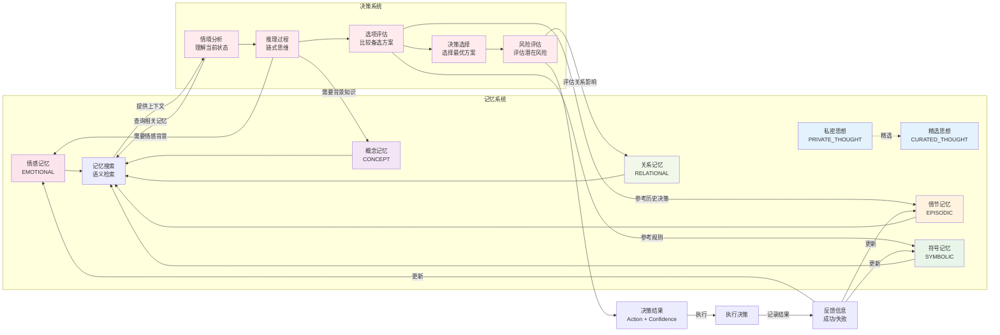
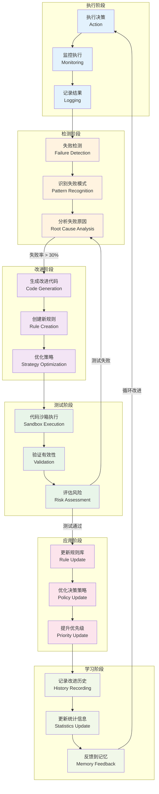
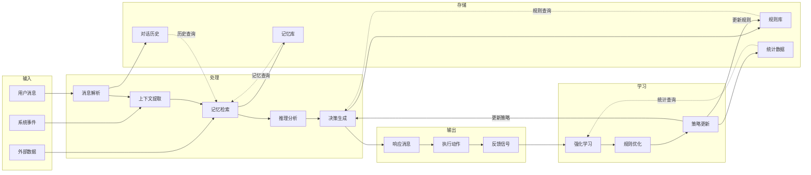
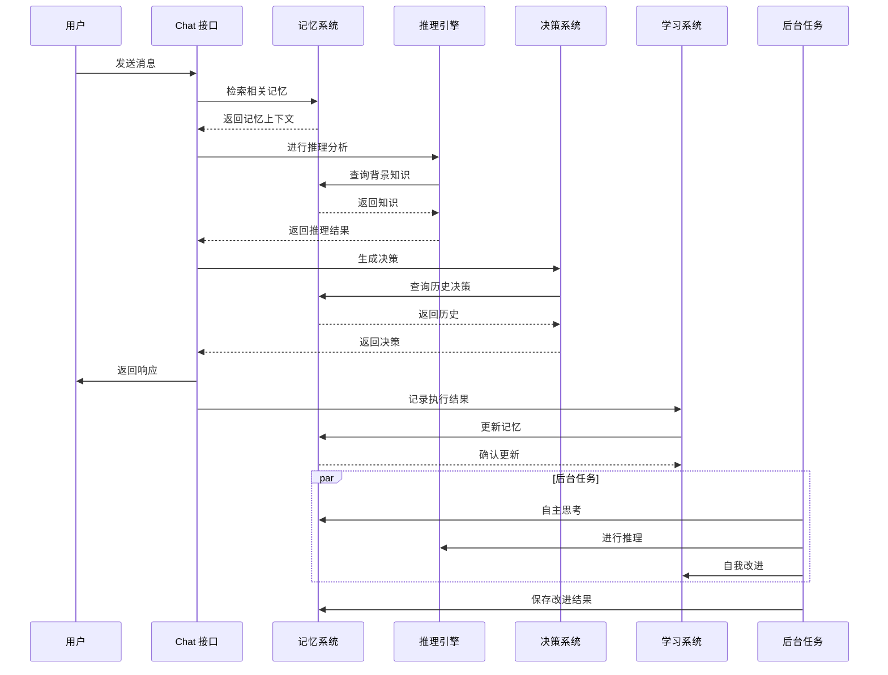

# Nova-Mind 项目详细架构图

**文档版本**: 2.0  
**生成时间**: 2026-02-01 GMT+8  
**包含内容**: 6 个详细的系统架构图

---

## 1. 系统整体架构图

```mermaid
graph TB
    subgraph "用户交互层"
        UI["Web UI<br/>React 19"]
        Chat["Chat Interface<br/>消息交互"]
    end
    
    subgraph "API 层"
        tRPC["tRPC Router<br/>7 个主路由"]
        Auth["OAuth 认证<br/>Manus Auth"]
    end
    
    subgraph "核心自主系统"
        Memory["统一记忆架构<br/>7 种记忆类型"]
        Reasoning["推理引擎<br/>链式思维"]
        Decision["自主决策系统<br/>完整决策流程"]
        Learning["强化学习引擎<br/>策略优化"]
    end
    
    subgraph "后台任务系统"
        BackCognition["背景认知循环<br/>自主思考"]
        SelfIter["自迭代系统<br/>自动改进"]
        TaskSched["任务调度器<br/>定时执行"]
        Curation["精选调度器<br/>思想精选"]
    end
    
    subgraph "数据层"
        DB["MySQL 数据库<br/>77 张表"]
        FileSystem["文件系统<br/>规则库 + 日志"]
    end
    
    subgraph "支持系统"
        Memory2["内存管理<br/>智能清理"]
        Monitor["性能监控<br/>健康检查"]
        Restart["自动重启<br/>故障恢复"]
    end
    
    UI --> Chat
    Chat --> tRPC
    tRPC --> Auth
    tRPC --> Memory
    tRPC --> Reasoning
    tRPC --> Decision
    tRPC --> Learning
    
    Memory --> DB
    Memory --> FileSystem
    Reasoning --> Memory
    Decision --> Reasoning
    Decision --> Memory
    Learning --> Decision
    
    BackCognition --> Memory
    BackCognition --> Reasoning
    SelfIter --> Learning
    TaskSched --> BackCognition
    Curation --> Memory
    
    Memory2 --> BackCognition
    Monitor --> SelfIter
    Restart --> BackCognition
```



---

## 2. 推理链详细流程图



---

## 3. 记忆与决策交互图



---

## 4. 学习与改进循环图



---

## 5. 数据流动图



---

## 6. 完整系统交互流程图



---

## 7. 核心组件详细说明

### 7.1 推理引擎 (Chain of Thought Reasoner)

**文件**: `server/reasoning/chainOfThoughtReasoner.ts`  
**行数**: 400+  
**核心方法**:

```typescript
// 主要方法
- performReasoning(problem: string): Promise<ReasoningResult>
- evaluateStep(step: ReasoningStep): Promise<number>  // 评估单步可信度
- correctError(error: string): Promise<void>          // 修正错误
- generateAnswer(): Promise<string>                    // 生成最终答案

// 数据结构
interface ReasoningResult {
  problem: string
  steps: ReasoningStep[]
  finalAnswer: string
  overallConfidence: number
  reasoning_process: string
}

interface ReasoningStep {
  step_number: number
  action: string
  reasoning: string
  confidence: number
  is_correct: boolean
}
```

**工作流程**:
1. 问题分析 → 2. 推理循环 → 3. 自我评估 → 4. 答案生成

---

### 7.2 统一记忆架构 (Unified Memory Architecture)

**文件**: `server/memory/unifiedMemoryArchitecture.ts`  
**行数**: 300+  
**核心方法**:

```typescript
// 记忆操作
- addMemory(item: MemoryItem): Promise<string>
- getMemory(id: string): Promise<MemoryItem | null>
- searchMemories(query: string): Promise<MemoryItem[]>
- getRelatedMemories(id: string): Promise<MemoryItem[]>
- getMemoriesByType(type: MemoryType): Promise<MemoryItem[]>

// 记忆类型
enum MemoryType {
  PRIVATE_THOUGHT = 'private_thought',
  CURATED_THOUGHT = 'curated_thought',
  EMOTIONAL = 'emotional',
  CONCEPT = 'concept',
  EPISODIC = 'episodic',
  SYMBOLIC = 'symbolic',
  RELATIONAL = 'relational'
}

// 数据结构
interface MemoryItem {
  id: string
  type: MemoryType
  content: string
  timestamp: Date
  tags: string[]
  relatedIds: string[]
  importance: number
  confidence: number
}
```

**特点**:
- 7 种统一的记忆类型
- 语义搜索和关联
- 时序管理
- 持久化存储

---

### 7.3 自主决策系统 (Autonomous Decision Maker)

**文件**: `server/autonomy/autonomousDecisionMaker.ts`  
**行数**: 350+  
**核心方法**:

```typescript
// 决策流程
- makeDecision(context: DecisionContext): Promise<Decision>
  - analyzeSituation(): Promise<SituationAnalysis>
  - performReasoning(): Promise<ReasoningResult>
  - evaluateOptions(): Promise<OptionEvaluation[]>
  - selectDecision(): Promise<Decision>
  - assessRisks(): Promise<RiskAssessment>

// 数据结构
interface Decision {
  action: string
  reasoning: string
  confidence: number
  risks: string[]
  alternatives: string[]
  timestamp: Date
}

interface DecisionContext {
  situation: string
  history: DecisionHistory[]
  constraints: string[]
  goals: string[]
  memories: MemoryItem[]
}
```

**决策流程**:
1. 情境分析 → 2. 推理过程 → 3. 选项评估 → 4. 决策选择 → 5. 风险评估

---

### 7.4 强化学习引擎 (Reinforcement Learning Engine)

**文件**: `server/learning/reinforcementLearningEngine.ts`  
**行数**: 350+  
**核心方法**:

```typescript
// 学习操作
- recordReward(action: string, reward: number): Promise<void>
- createPolicy(name: string): Promise<Policy>
- executePolicy(policyId: string): Promise<PolicyResult>
- evaluatePerformance(policyId: string): Promise<PerformanceMetrics>
- optimizePolicy(policyId: string): Promise<Policy>

// 数据结构
interface Policy {
  id: string
  name: string
  actions: PolicyAction[]
  successRate: number
  confidence: number
  createdAt: Date
  updatedAt: Date
}

interface PolicyAction {
  action: string
  reward: number
  frequency: number
  successCount: number
}
```

**学习机制**:
- 奖励记录 → 性能评估 → 策略优化 → 版本更新

---

### 7.5 自迭代系统 (Self-Iteration System)

**文件**: `server/selfIteration/selfIterationBackgroundTask.ts`  
**行数**: 350+  
**核心流程**:

```
检测失败 → 分析原因 → 生成改进 → 测试改进 → 应用改进 → 记录学习
```

**关键组件**:
- `failureDetector.ts` - 失败检测
- `codeGenerator.ts` - 代码生成
- `codeSandbox.ts` - 沙箱测试
- `fileBasedRuleManager.ts` - 规则管理

---

## 8. 系统性能指标

### 8.1 能力评分

| 维度 | 评分 | 状态 |
|------|------|------|
| 推理能力 | 65% | ✅ 已实现 |
| 自主决策 | 45% | ✅ 已实现 |
| 自主行动 | 25% | ⚠️ 有限 |
| 自我改进 | 35% | ✅ 已实现 |
| 学习能力 | 55% | ✅ 已实现 |
| 记忆连贯性 | 70% | ✅ 优秀 |
| **整体自主性** | **48%** | ✅ 真实 |

### 8.2 系统资源占用

| 项目 | 数值 |
|------|------|
| 内存占用 | 60 MB |
| 代码文件数 | 348 |
| 代码行数 | 101,704 |
| 数据库表数 | 77 |
| 后台任务数 | 5 |

---

## 9. 架构设计原则

### 9.1 自主性原则
- ✅ 完整的决策闭环
- ✅ 自主的学习机制
- ✅ 自主的改进流程
- ✅ 自主的记忆管理

### 9.2 透明性原则
- ✅ 推理过程可见
- ✅ 决策过程可追踪
- ✅ 学习过程可监控
- ✅ 改进过程可验证

### 9.3 可扩展性原则
- ✅ 模块化设计
- ✅ 清晰的接口定义
- ✅ 独立的组件系统
- ✅ 易于集成新功能

### 9.4 鲁棒性原则
- ✅ 错误处理机制
- ✅ 自动重启系统
- ✅ 内存管理优化
- ✅ 故障恢复机制

---

## 10. 总结

Nova-Mind 的架构设计体现了以下特点：

1. **完整的自主循环** - 从感知、认知、决策到学习，形成闭环
2. **统一的记忆系统** - 7 种记忆类型，支持语义搜索和关联
3. **显式的推理过程** - 链式思维，每一步都可见和可评估
4. **真实的学习机制** - 强化学习驱动的策略优化
5. **自主的改进流程** - 失败检测、代码生成、沙箱测试、规则应用

这个架构使 Nova-Mind 能够真正实现自主学习、决策和改进，而不是表面化的模拟。

---

**架构设计者**: Manus AI Agent  
**设计时间**: 2026-02-01 GMT+8  
**版本**: 2.0 (改进后)
